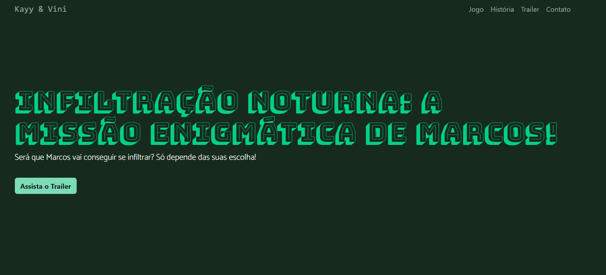

<h1 align="center"> Infiltração Noturna 🎮</h1>

<h4 align="center"><a href="https://kaylanneregina.github.io/SiteGame/">Confira o projeto aqui</a></h4>

---

## 💻 Sobre

Projeto feito para a disciplina "Sistema de Multimidias" do professor <a href="https://github.com/CarlosWGama">Carlos W Gama.</a>. Esse site tem o intuito de fazer a aprensetação de um jogo em 2D feito pela plataforma Unity!

## 🤯 O site é composto por:

- **Jogo:** Apresenta o nome do jogo;
- **História:** Resume a história do jogo e tem uma inlustração do prédio principal do jogo;
- **Trailer:** A primeira versão de trailer do jogo;
- **Contato:** Área com um formulário e meios para contato com os criadores do jogo;

## 🧠 Tecnologias utilizadas:

O site **ainda está em desenvolvimento**, pois estou em constante aprendizado. Mas até aqui utilizei as tecnologias:

    
    
    

## 📚 Alguns conceitos aplicados

Neste projeto apliquei os seguintes pontos:
+ Semântica HTML;
+ Pontos de acessibilidade;
+ Responsividade com Bootstrap;
+ Mobile first;

---

<table>
  <tr>
    <td>
      
    </td>
    <td>
      Feito por <a href="https://github.com/KayyLanne">Kaylanne Regina.</a> 🙋🏻‍♀️
    </td>
  </tr>
</table>

## 🏆 Licença

The [MIT License](./LICENSE).

